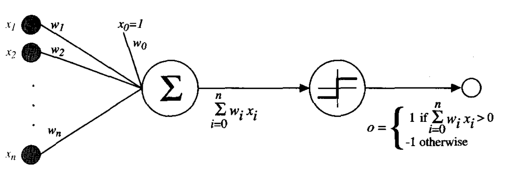

# Perceptron Explanation and Decision Boundary

## Understanding the Perceptron
A perceptron is a fundamental unit of a neural network. It takes weighted inputs and applies an activation function to determine the output.

---
A perceptron consists of:
- **Inputs (`x1`, `x2`, ...)** → Features such as CGPA and Resume Score  
- **Weights (`w1`, `w2`, ...)** → Importance assigned to each feature  
- **Bias (`b`)** → Shifts the decision boundary  
- **Activation Function** → Step function to decide whether the output is `0` or `1`
